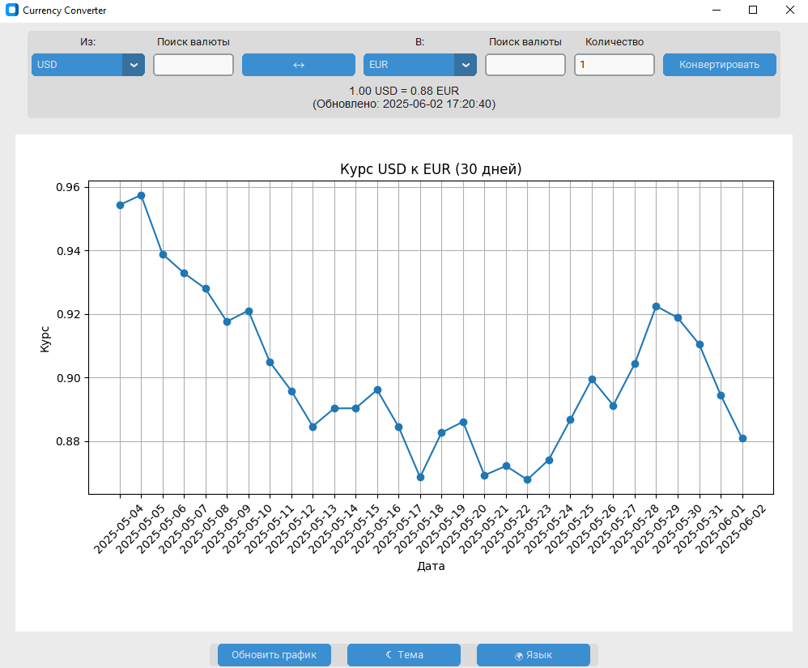
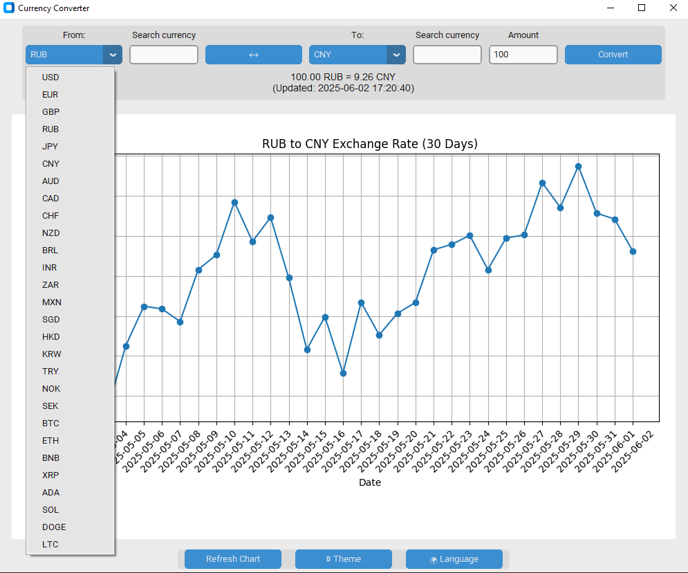

# 💱 TRPP_PROJECT_converter
**Currency converter with chart**

## 📌 Описание проекта

Графическое приложение-конвертер валют с поддержкой криптовалют, созданное на Python с использованием библиотеки `customtkinter`.

### ✅ Возможности:
- 🔄 Конвертация валют и криптовалют между собой.
- 🌍 Поддержка более **25 популярных валют и криптовалют** (USD, EUR, BTC, ETH и др.).
- 📊 Построение **динамического графика курса за последние 30 дней**.
- 🎨 Переключение темы (светлая/тёмная).
- 🈯 Поддержка **двух языков** интерфейса: русский и английский.
- 🌐 Работа **офлайн** при отсутствии интернета (резервные курсы).

---

## ⚙️ Как работает

### 🔗 Загрузка курсов валют:
- Основной API: [`exchangerate-api.com`](https://www.exchangerate-api.com/)
- Резервный API: [`exchangerate.host`](https://exchangerate.host/)
- Криптовалюты: [`CoinGecko API`](https://www.coingecko.com/)

### 💡 Интерфейс:
- Выбор валют **"Из"** и **"В"**
- Ввод суммы для конвертации
- Кнопка **расчёта и вывода результата**
- Поиск по валютам для удобства
- Кнопка для **обновления графика**

---

## 📦 Установка зависимостей

Убедитесь, что у вас установлен Python 3.9+.

Установите необходимые библиотеки:

```pip install requests```

```pip install customtkinter```

```pip install matplotlib ```

Либо воспользуйтесь командой ```pip install -r requirements.txt```

Код проекта и файл с зависимостями лежат в ветке master

Внешний вид приложения:




